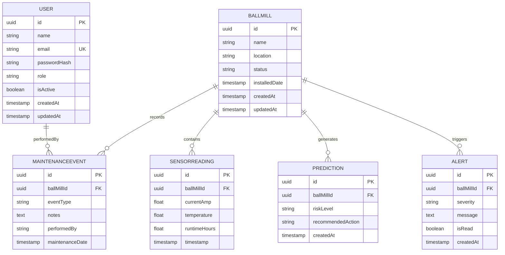

# Database Structure & Entity Relationship Diagram

## Overview

The GEOMINE Ball Mill Health Monitoring system uses PostgreSQL with the following 6 core entities and their relationships.

## Entity Relationship Diagram



## Table Details

### 1. User Table

Stores system users with role-based access control.

| Column         | Type         | Constraints      | Notes                  |
| -------------- | ------------ | ---------------- | ---------------------- |
| `id`           | UUID         | Primary Key      | Auto-generated         |
| `name`         | VARCHAR(255) | Not Null         | User's full name       |
| `email`        | VARCHAR(255) | Unique, Not Null | Login credential       |
| `passwordHash` | VARCHAR(255) | Not Null         | bcrypt hashed password |
| `role`         | VARCHAR(255) | Not Null         | "ADMIN" or "MINER"     |
| `isActive`     | BOOLEAN      | Default: true    | Soft delete support    |
| `createdAt`    | TIMESTAMP    | Default: NOW()   | Audit trail            |
| `updatedAt`    | TIMESTAMP    | Default: NOW()   | Audit trail            |

**Indexes:** `email`

### 2. BallMill Table

Represents physical ball mill equipment.

| Column          | Type         | Constraints    | Notes                          |
| --------------- | ------------ | -------------- | ------------------------------ |
| `id`            | UUID         | Primary Key    | Auto-generated                 |
| `name`          | VARCHAR(255) | Not Null       | Equipment identifier           |
| `location`      | VARCHAR(255) | Not Null       | Physical location              |
| `status`        | VARCHAR(255) | Not Null       | OPERATIONAL, MAINTENANCE, etc. |
| `installedDate` | TIMESTAMP    | Not Null       | Commissioning date             |
| `createdAt`     | TIMESTAMP    | Default: NOW() | Audit trail                    |
| `updatedAt`     | TIMESTAMP    | Default: NOW() | Audit trail                    |

**Indexes:** `name`, `location`

**Relationships:**

- One-to-Many: SensorReading
- One-to-Many: MaintenanceEvent
- One-to-Many: Prediction
- One-to-Many: Alert

### 3. SensorReading Table

Time-series data from equipment sensors.

| Column         | Type             | Constraints  | Notes                  |
| -------------- | ---------------- | ------------ | ---------------------- |
| `id`           | UUID             | Primary Key  | Auto-generated         |
| `ballMillId`   | UUID             | FK, Not Null | References BallMill.id |
| `currentAmp`   | DOUBLE PRECISION | Not Null     | Current draw (Amps)    |
| `temperature`  | DOUBLE PRECISION | Not Null     | Temperature (°C)       |
| `runtimeHours` | DOUBLE PRECISION | Not Null     | Cumulative runtime     |
| `timestamp`    | TIMESTAMP        | Not Null     | Reading timestamp      |

**Indexes:** `ballMillId`, `timestamp`

**Usage:** High-volume writes (frequent sensor data ingestion)

### 4. MaintenanceEvent Table

Records maintenance actions performed on equipment.

| Column            | Type         | Constraints  | Notes                      |
| ----------------- | ------------ | ------------ | -------------------------- |
| `id`              | UUID         | Primary Key  | Auto-generated             |
| `ballMillId`      | UUID         | FK, Not Null | References BallMill.id     |
| `eventType`       | VARCHAR(255) | Not Null     | GREASING, INSPECTION, etc. |
| `notes`           | TEXT         | Optional     | Details of maintenance     |
| `performedBy`     | VARCHAR(255) | Not Null     | Technician name            |
| `maintenanceDate` | TIMESTAMP    | Not Null     | When maintenance occurred  |

**Indexes:** `ballMillId`, `maintenanceDate`

### 5. Prediction Table

Stores predictions and recommended maintenance actions.

| Column              | Type         | Constraints    | Notes                    |
| ------------------- | ------------ | -------------- | ------------------------ |
| `id`                | UUID         | Primary Key    | Auto-generated           |
| `ballMillId`        | UUID         | FK, Not Null   | References BallMill.id   |
| `riskLevel`         | VARCHAR(255) | Not Null       | HIGH, MEDIUM, LOW        |
| `recommendedAction` | VARCHAR(255) | Not Null       | Suggested action         |
| `createdAt`         | TIMESTAMP    | Default: NOW() | When prediction was made |

**Indexes:** `ballMillId`, `createdAt`

### 6. Alert Table

Triggers alerts based on sensor thresholds.

| Column       | Type         | Constraints    | Notes                   |
| ------------ | ------------ | -------------- | ----------------------- |
| `id`         | UUID         | Primary Key    | Auto-generated          |
| `ballMillId` | UUID         | FK, Not Null   | References BallMill.id  |
| `severity`   | VARCHAR(255) | Not Null       | CRITICAL, WARNING, INFO |
| `message`    | TEXT         | Not Null       | Alert description       |
| `isRead`     | BOOLEAN      | Default: false | Read status tracking    |
| `createdAt`  | TIMESTAMP    | Default: NOW() | Alert timestamp         |

**Indexes:** `ballMillId`, `severity`, `createdAt`

## Key Relationships

```
User (1) ─── (N) MaintenanceEvent
  └─ Audit who performed maintenance

BallMill (1) ─── (N) SensorReading
  └─ Time-series sensor data per equipment

BallMill (1) ─── (N) MaintenanceEvent
  └─ History of maintenance actions

BallMill (1) ─── (N) Prediction
  └─ Predictive maintenance recommendations

BallMill (1) ─── (N) Alert
  └─ Alert notifications
```

## Data Flow

### Sensor Data Ingestion

```
1. Sensor → API POST /api/sensors
2. SensorReading inserted
3. Health calculator runs
4. Prediction engine evaluates rules
5. Alerts generated if thresholds exceeded
6. Alert records inserted
```

### Maintenance Recording

```
1. User → API POST /api/maintenance
2. MaintenanceEvent inserted
3. BallMill.status updated (optional)
4. Dashboard notified
```

### Health Query

```
1. Client → API GET /api/health/:ballMillId
2. Latest SensorReading retrieved
3. Health score calculated
4. Status (HEALTHY/WARNING/CRITICAL) returned
```

## Indexing Strategy

All foreign keys and frequently-queried columns are indexed for performance:

- `User.email` — Login lookups
- `SensorReading.ballMillId, timestamp` — Range queries for time-series data
- `MaintenanceEvent.ballMillId, maintenanceDate` — Historical lookups
- `Alert.ballMillId, severity, createdAt` — Filtering and sorting
- `Prediction.ballMillId, createdAt` — Recent predictions

## Constraints & Cascade Behavior

- **Foreign Keys:** RESTRICT on delete (prevent orphaned records)
- **Unique Constraints:** User.email (one email per user)
- **Soft Delete:** User.isActive boolean flag (data retention)
- **Timestamps:** All tables track creation and modification times

## Performance Considerations

### Write-Heavy Table

**SensorReading** — Expect high-volume inserts from sensor IoT devices

- Partition by timestamp or ballMillId for very large deployments
- Use batch insert for bulk ingestion

### Query Patterns

- **Latest readings:** Use timestamp DESC LIMIT 1
- **Time-series aggregation:** GROUP BY hour/day
- **Alert history:** ORDER BY createdAt DESC with isRead filter
- **Maintenance timeline:** ORDER BY maintenanceDate DESC

## Example Queries

### Get Health Snapshot

```sql
SELECT sr.*,
       CASE
         WHEN sr.temperature < 65 THEN 'HEALTHY'
         WHEN sr.temperature BETWEEN 65 AND 75 THEN 'WARNING'
         ELSE 'CRITICAL'
       END as status
FROM "SensorReading" sr
WHERE sr."ballMillId" = $1
ORDER BY sr.timestamp DESC
LIMIT 1;
```

### Get Maintenance Trend

```sql
SELECT DATE(maintenance_date) as date,
       COUNT(*) as maintenance_count,
       ARRAY_AGG(DISTINCT event_type) as event_types
FROM "MaintenanceEvent"
WHERE "ballMillId" = $1
  AND maintenance_date >= NOW() - INTERVAL '90 days'
GROUP BY DATE(maintenance_date)
ORDER BY date DESC;
```

### Get Alert Summary

```sql
SELECT severity, COUNT(*) as count
FROM "Alert"
WHERE "ballMillId" = $1
  AND "createdAt" >= NOW() - INTERVAL '7 days'
GROUP BY severity
ORDER BY count DESC;
```

## Migration Notes

When running `npm run prisma:migrate`:

1. Prisma CLI reads `prisma/schema.prisma`
2. Generates migration files in `prisma/migrations/`
3. Applies DDL to PostgreSQL via DATABASE_URL
4. Creates indexes automatically
5. Seeds initial data if `prisma/seed.ts` is configured
